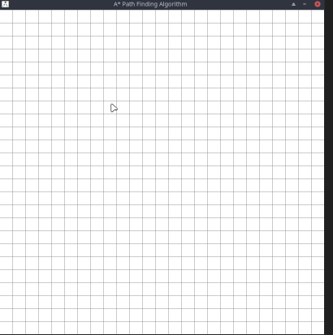
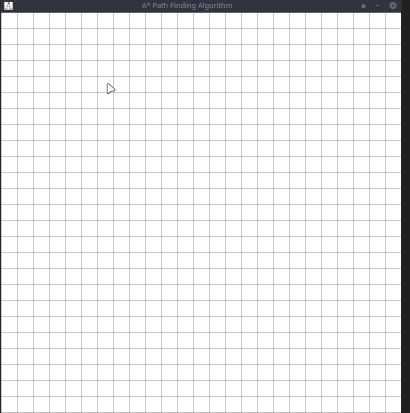

# Pathfinding Visualizer A*
___

## What is this A* algorithm ?
Simply put, it is an algorithm that aims to find the shortest possible path between two locations.
## Why A* Search Algorithm? 
Informally speaking, A* Search algorithms, unlike other traversal techniques, it has brains. What it means is that it is really a smart algorithm which separates it from the other conventional algorithms. 
And it is also worth mentioning that many games and web-based maps use this algorithm to find the shortest path very efficiently (approximation). 
___
## Setup 
Just open the executables everything is precompiled so everything should work without a problem :)) or you can buildit from source code if you are using win good luck with pip :))).

## Utilization
___
1. First you need to designate your start and your end point. Your first two left clicks will be asigned to your start position and respective your end position.
2. If you wanna put an obstacle you just need to press your left click on the coresponding square. You can also hold your click to place multiples obstacles at the same time.
3. If you want to change any point on the map just press right click instead of left and the coresponding point will be deleted.
4. After you set up your path you can press SPACE to start the simulation.
5, If you wanna reset the entire program don't worry you don't need to close it just press C on your keyboard 
6. Have fun when learning how A* works :)

## Examples 
              

## Explication 
Consider a square grid having many obstacles and we are given a starting cell and a target cell. We want to reach the target cell (if possible) from the starting cell as quickly as possible. Here A* Search Algorithm comes to the rescue.

What A* Search Algorithm does is that at each step it picks the node according to a value-‘f’ which is a parameter equal to the sum of two other parameters – ‘g’ and ‘h’. At each step it picks the node/cell having the lowest ‘f’, and process that node/cell.

We define ‘g’ and ‘h’ as simply as possible below

g = the movement cost to move from the starting point to a given square on the grid, following the path generated to get there. 

h = the estimated movement cost to move from that given square on the grid to the final destination. This is often referred to as the heuristic, which is nothing but a kind of smart guess. We really don’t know the actual distance until we find the path, because all sorts of things can be in the way (walls, water, etc.).

There can be many ways to calculate this ‘Simpleh’ which are discussed in the later sections.

# Building 

## WINDOWS only 
!!For WINDOWS don't forget to check in the python installer if the path variables are added. Otherwise you are not gonna have a great timne with pip.
Alternatively you can repair your python installation and check when it ask you if you want to add variables to the path.
 If you have problems with pip you can try this https://www.activestate.com/resources/quick-reads/how-to-install-pip-on-windows/

## Dependencies
1.Python version > 3.0
2.pygame
3.cx_Freeze

## How to install pygame and cx_Freeze
If you want to install pygame and cx_Freeze you need to use `pip` running this command in your terminal of choice:

`pip install pygame`

`pip install cx_Freeze`

## Building the project from source 

If you want to build the project from source, you need to use the script provided in source code called `setup.py`:
In Linux OS run: 
`python setup.py build`

In Windows run:
`python setup.py bdist_msi`

In MacOs run:
`python setup.py bdist_dmg`
